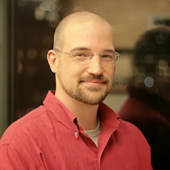

## Profile {#profile}
Highly creative problem solver that has adapted to a rapidly changing field for over 15 years.  Consistently innovating to new technology across multiple industries for small, medium, and large organizations. Experience directing in-house and outsourced technical teams to deliver results with challenging budgets and timelines.  Authors operational procedures and has experience managing operational teams consisting of up to 25 direct reports

## Core Competencies {#corecompetencies}

| Hands-on                      | Leadership           | Executive              |
| ----------------------------- | :------------------: | ---------------------: |
| NET Framework & .NET Core     | Career Development   | KPI Authoring          |
| RESTful Web Services          | Team Building        | ISO Compliance         |
| Azure Architecture            | AGILE Methodology    | Vendor Management      |
| Database Administration       | APartner Management  | Stakeholder Engagement |

## Professional Experience {#experience}
### Automated Business Designs
#### Chief Technology Officer
*July 2019-Present*

* Unified project management for a technology stack spanning from VB6 to .NET Core 3.
* Introduced cloud architecture, automated UI testing, and CI/CD for all projects.
* Maintains a roadmap of technical milestones for the organization.
* Meets regularly with vendors, partners, and priority customers to keep relationships healthy and create new initiatives.
* Replaced several low performing products from the portfolio with newer high performing alternatives.

### National Real Tax Tracking
#### Chief Technology Officer
*May 2017-July 2019*
* Plays a leading part in setting the corporate strategy to sustain $4 million increase in annual revenue across new markets and product lines.
* Establishes the company’s technical vision and leads all aspects of the company’s technological development.
* Provides leadership to department heads in a fashion that supports the company’s culture, mission, and values.
* Conducts research and case studies on leading-edge technologies and makes determinations on the probability of implementation.
* Develops and maintains style guides for an outsourcing partner’s 2-5 technical resources to develop extractors for over 1000 different data sources.
* Manages expansion to three satellite offices, while establishing guidelines to effectively expand to hundreds more.
* Oversees and contributes to development projects such as .NET Core back ends, Angular front ends, and Octopus driven CI/CD.

#### Director of Operations and Technology
*Mar 2016-May 2017*
* Monthly reporting of technology initiatives and newly established cost per unit metrics to stakeholders. 
* Translate complex business requirements that span several eras and contracts into a concise data model that allows operations to service all customers with the same internal process.
* Work closely with staff and management to model a tax payment process that facilitates payments to municipalities across the United States on behalf of any client in any industry and exceeds financial industry auditing standards. 
* Communicate upcoming changes to staff, and work directly with customer service and marketing for client facing changes. 
* Directly manage and mentor up to 25 direct reports.

#### Senior Applications Developer
*Jan 2013-Mar 2016*
* Plan, direct and develop web-based, mobile, and enterprise wide applications for both internal staff and external client access.
* Program new solutions for tracking property taxes for all counties of the United States.
* Keep up to date knowledge of relevant skill sets including C#, MVC, Web API, Microsoft SQL, and HTML5/CSS3/JQuery.
* Leverage related Telerik suites for rapid development and a consistent user experience.

### PropertyInfo Corporation
#### Software Developer
*Jan 2011-Mar 2013*
* Program new solution for electronic filing of court cases that can accept localized rules and regulations to easily apply to any United States county.
* Develop web and desktop front ends for web services to allow application interoperability across a wide variety of operating systems and mobile platforms.
* Design administrative interfaces to streamline maintenance on legacy applications.
* Maintain and improve a high volume delivery platform utilizing new storage and technologies to keep it scalable.

#### Production Support Engineer
*Feb 2007-Jan 2011*
* Maintain and support several production data centers housing licensed and custom applications.
* Microsoft SQL database administration with focus on improving stability, performance, and redundancy.
* Automate production tasks such as processing daily data and images from municipalities.
* Discover, document, and replace several legacy applications without impact to daily operations.
* Implement VMware environment to reduce costs, required administration, and provide clear disaster recovery options.
* Ensure all environments and production changes are compliant with Sarbanes-Oxley standards and provide evidence to auditing teams.

### TriNET Inc.
#### IT Engineer
*Jan 2006-Feb 2007*
* Website design and programming using PHP5 and MySQL.
* Logo design and print marketing design.
* Active Directory and Exchange 2003 installation, migration, and support.
* Support Cisco routers and switches, used for load balancing large LANs and WANs.
* Disaster Recovery and security compliance policy implementation including the coordination and execution of written policies, offsite backup management, and administration of tape libraries using Veritas Backup Exec software.

### Certified Health Enrollment Services
#### IT Engineer
*Mar 2003-Jan 2006*
* Microsoft SQL and Firebird SQL administration.
* Migration of desktop, server, network, application, and website policies to HIPAA Security compliance satisfaction.
* Administration of a mixed operating system, multiple server environment that included Red Hat Enterprise Linux and Windows Server 2003.
* Administration of Sonicwall appliances for VPN, NAT, content filtering, and WAN Failover.

### Illinois Institute of Technology
#### Audio/Video Supervisor
*Sept 2001-Sept 2005*
* Management of a small team to ensure product delivery and critical network uptime.
* Design and implement a PHP and MySQL catalog of recorded lectures and scanned instructor notes associated with each lecture.
* Part-time support of a multiple site VPN for a mixed video-over-IP environment intended for the broadcast and recording of graduate-level classes.
* Operate a video switch board to control proper video composition and audio mastering to ensure high quality transmission.
* Installation and maintenance of professional television and video conference equipment in a studio/classroom environment. 

## Education {#education}

### Westwood College
#### Bachelors of Applied Science
* Managed a 5 person team that completed an implementation of a Sarbanes-Oxley compliant environment including Cisco network infrastructure, active directory, and Exchange faster than any previous team in campus history.
* Awarded multiple Dean’s List certificates for outstanding academic achievement.
* Completed Cisco Network Academy CCNA curriculum.

### Technology Center of DuPage, 
#### Two Year Certificate of Completion
* Received DuPage County Student of the Month award for partaking in a ComEd-sponsored project to propose new lighting and windows to lower energy cost for the campus.
* Received Senior Recognition award.

## Certifications {#certifications}
### VMware
* VMware Certified Professional (VCP #50635)
### CompTIA
* A+ Certified Technician
### Brainbench
* HIPAA (Security)
* Cisco Network Support
* Disaster Recovery and Planning
* Microsoft Windows Active Directory
